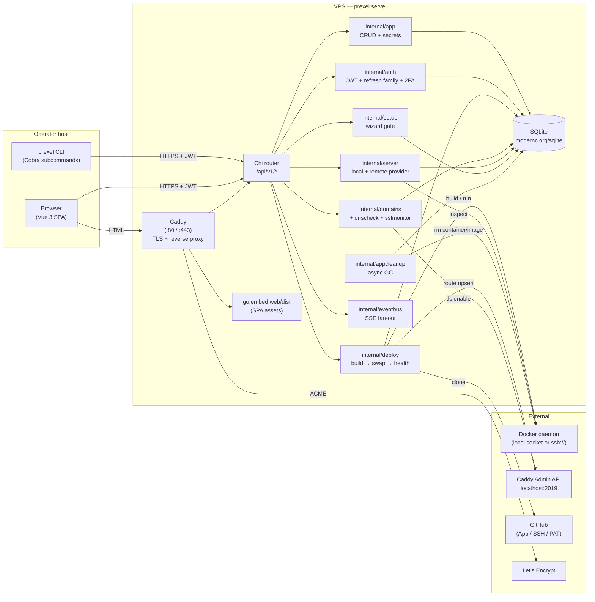
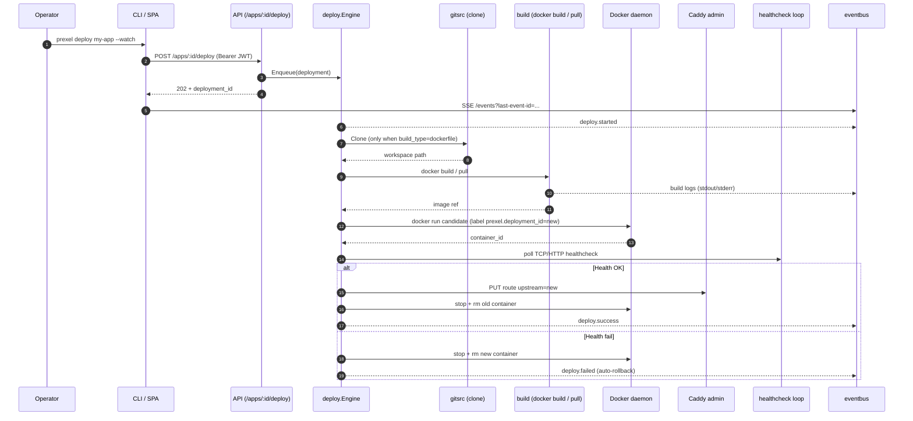
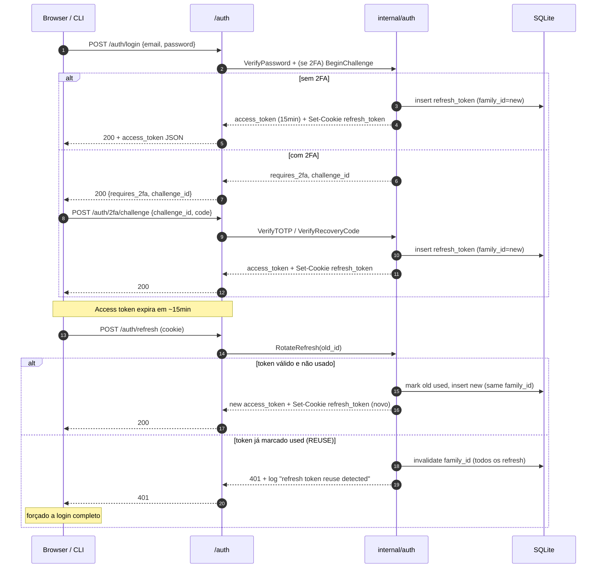
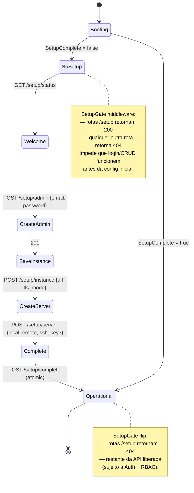

# Arquitetura — visão de nível alto

Doc operacional dos componentes do Prexel e dos fluxos críticos. A spec
detalhada e o rationale de cada decisão ficam no Confluence
([Architecture](https://hotsed.atlassian.net/wiki/spaces/Prexel/pages/655362),
[Stack & Tech Decisions](https://hotsed.atlassian.net/wiki/spaces/Prexel/pages/688130),
[Tech Review — Gaps & Decisões](https://hotsed.atlassian.net/wiki/spaces/Prexel/pages/622598)).

---

## 1. Componentes

O Prexel é **um único binário Go** que assume papéis diferentes conforme o
subcomando: `prexel serve` é o daemon; qualquer outra invocação (`prexel app
list`, `prexel deploy`, etc.) é um cliente HTTP que fala com esse daemon.



Resumo:

- **CLI e Web UI** são duas frentes para a mesma API REST. Nenhum dos dois
  acessa banco, Docker ou Caddy diretamente — a regra é estrita (ver
  `CLAUDE.MD §"CLI nunca duplica lógica de backend"`).
- **Caddy** termina TLS no `:443` e roteia: requests para o host da
  instância vão para o API server (Chi) ou pra SPA embedada via `go:embed
  web/dist`; requests para hosts de apps gerenciados vão pros containers na
  bridge `prexel-net`.
- **SQLite** (modernc, pure-Go) é o único banco. Migrations via
  `golang-migrate` aplicadas no boot.
- **Docker daemon** acessado via socket local ou `ssh://` (servidor remoto).
  Cada `internal/server` Provider abstrai o transporte.
- **Eventbus** in-memory + ring buffer alimenta SSE (`/events`, logs de
  deploy) com replay via `Last-Event-ID`.

---

## 2. Fluxo de deploy



Pontos chave:

- **Zero downtime**: a swap só acontece após o healthcheck do candidato passar.
  O container antigo continua servindo até a rota do Caddy ser atualizada.
- **Auto-rollback** dispara quando o healthcheck do candidato falha — o
  container antigo nunca é tocado nesse caminho.
- **Logs em tempo real**: cada linha de build + cada transição de estado vão
  pra `eventbus` e são consumidas por SSE no UI/CLI (`--watch`).
- **Retenção de imagens**: `internal/appcleanup` mantém as últimas N imagens
  por app (5 por padrão); deploys mais antigos são GCed pro Docker prune.

---

## 3. Fluxo de autenticação



Por que famílias?

- Refresh tokens são rotacionados a cada uso. O ID antigo fica no banco
  marcado `used_at=...`.
- Se o ID antigo for usado de novo (típico de roubo de cookie), a família
  inteira é invalidada — o atacante e a vítima ambos perdem acesso, e o
  evento entra no audit log. Mais barato que detectar "qual dos dois é o
  atacante" e mais seguro que confiar.

---

## 4. Setup wizard

State machine do `prexel serve` na 1ª boot até o admin existir:



`MarkComplete` é idempotente sob concorrência (testado em
`internal/setup/setup_test.go`) — duas chamadas paralelas não criam dois
admins.

---

## 5. Decisões de arquitetura (resumo)

| Decisão                          | Por quê                                                                                                                               |
|----------------------------------|---------------------------------------------------------------------------------------------------------------------------------------|
| **Single binary**                | `caddy`/`consul`/`nomad`-style. Instalação trivial (`curl \| sh`), upgrades atômicos, sem orquestração lateral.                       |
| **SQLite (modernc, pure-Go)**    | Zero ops. Não precisa de Postgres pra rodar 1 instância. Backup = `tar /var/lib/prexel`. Pure-Go = sem CGO no build estático.         |
| **Caddy embutido**               | TLS automático com Let's Encrypt, admin API JSON-first (sem reload de config), suporta on-demand TLS para domínios de tenants.        |
| **Vue 3 + embed**                | SPA empacotada no binário via `go:embed web/dist`; deploy do UI = deploy do servidor. History fallback no router serve `index.html`.  |
| **Chi router**                   | Middleware nativo + sub-routers; cabeçalho idiomático Go (em vez de gin, etc.).                                                       |
| **JWT HS256 (não RS)**           | 1 chave, 1 audience — não estamos federando. HS é menos bug-prone e mais rápido.                                                      |
| **Refresh por família**          | Detecção de reuse com baixo custo de implementação. Ver §3.                                                                           |
| **AES-256-GCM com HKDF**         | Cripto padrão moderna autenticada. HKDF deriva sub-keys por purpose (secret vs. SSH key vs. TOTP).                                    |
| **Eventbus in-memory + ring buffer** | Para SSE de logs e progresso. Não precisa de Redis pra v0.1; replay via `Last-Event-ID` cobre reconexões.                          |
| **Docker via socket / `ssh://`** | Single abstraction para local + remote — `internal/server.Provider`. Sem agent custom em cada VPS.                                    |
| **Sem `prexelctl`**              | Confunde packaging. `prexel serve` + `prexel <verb>` são o mesmo binário (ver `CLAUDE.MD`).                                           |

A discussão longa de cada item está em
[Stack & Tech Decisions](https://hotsed.atlassian.net/wiki/spaces/Prexel/pages/688130)
e nas [Análise Coolify vs Prexel](https://hotsed.atlassian.net/wiki/spaces/Prexel/pages/1212419)
no Confluence.

---

## 6. Layout de código (recap)

```
main.go                       # ~30 linhas; injeta embed.FS em internal/cli.Execute
internal/cli/command/         # Cobra tree (serve.go + clientes)
internal/cli/client/          # cliente HTTP (TOFU, cookie store, JWT)
internal/api/                 # router.go + handler/* + apimiddleware/*
internal/{auth,setup,app,deploy,domains,server,gitsrc,secret,...}/
                              # serviços (acessam DB / Docker / Caddy)
internal/crypto/              # AES-GCM + HKDF
internal/eventbus/            # SSE fan-out + ring buffer
web/                          # Vue 3, build vai pra web/dist (embedado)
migrations/                   # golang-migrate (up/down pares)
```

Princípio de dependência: `internal/cli/*` só pode importar
`internal/cli/client`, `internal/cli/tableutil`, `internal/cli/config` — nunca
um service. Quebrar isso quebra a paridade CLI ↔ UI (CLI deixaria de testar a
mesma rota que a UI usa).
